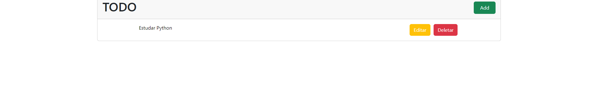
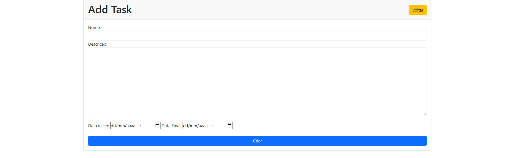
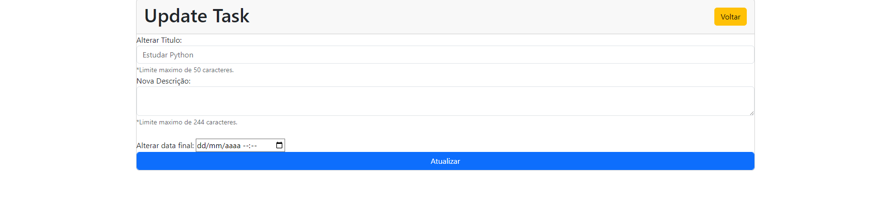
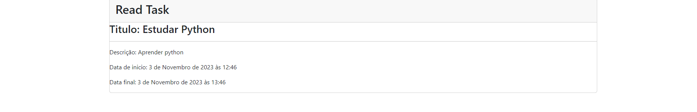

# Projeto TODO List com Django e Bootstrap

## Introdução

Este é um projeto simples de lista de tarefas (TODO List) desenvolvido com o framework Django e estilizado com Bootstrap. O objetivo deste projeto é aplicar as principais funcionalidades que aprendi no Django até o momento, incluindo operações CRUD (Create, Read, Update, Delete) para gerenciar uma lista de tarefas.

## Funcionalidades

O projeto inclui as seguintes funcionalidades:

1. **Listagem de Tarefas**: Exibe uma lista de todas as tarefas existentes, com opções de adicionar, deletar, editar as tarefas e vizualizar as tarefas.

2. **Adição de Tarefas**: Permite adicionar novas tarefas à lista, incluindo um título e uma descrição.

3. **Edição de Tarefas**: Permite editar o título e a descrição de tarefas existentes.

4. **Exclusão de Tarefas**: Permite excluir tarefas da lista.

5. **Visualização da Tarefa**: Permite vizualizar as tarefas listadas.

6. **Estilo com Bootstrap**: O projeto utiliza a biblioteca Bootstrap para melhor vizualização do projeto.

## Tecnologias Utilizadas

- **Django**: Framework web Python para o desenvolvimento de aplicativos web.
- **Bootstrap**: Framework de código aberto para estilizar a interface do usuário.
- **Banco de Dados SQLite**: Banco de dados embutido para armazenar as tarefas.

